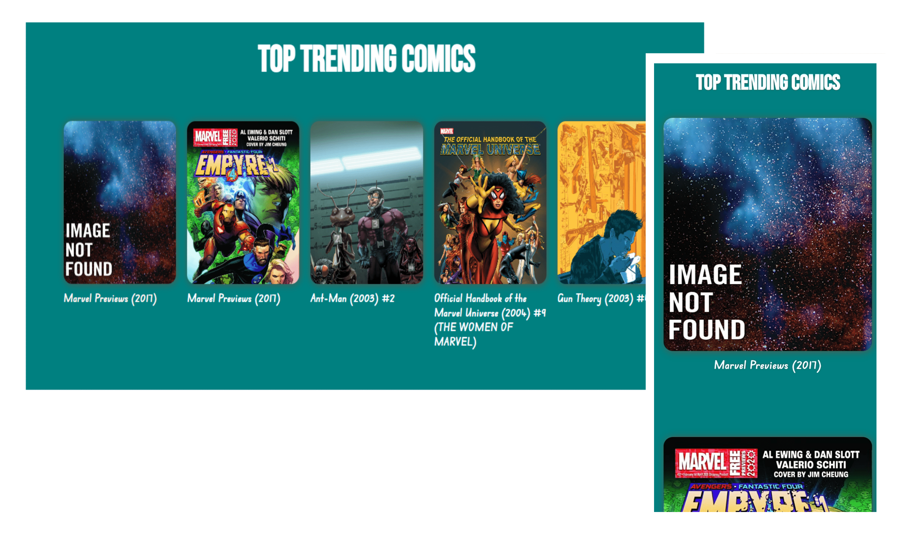
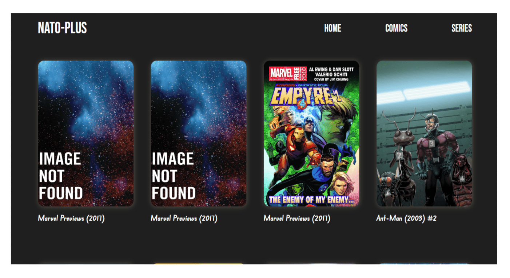
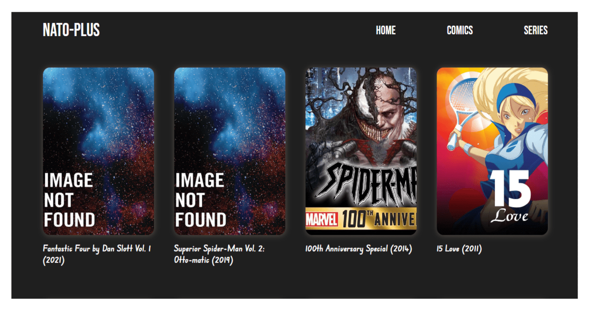
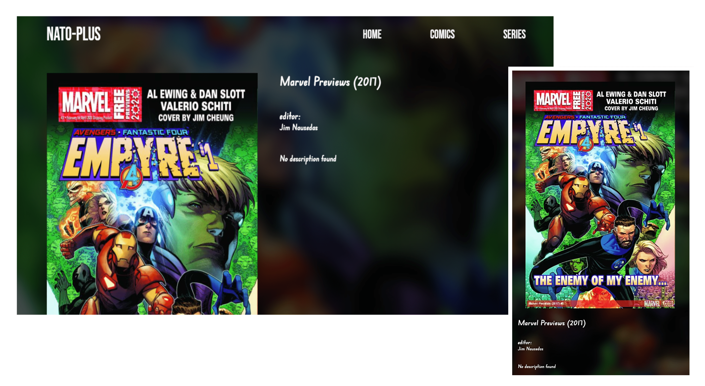
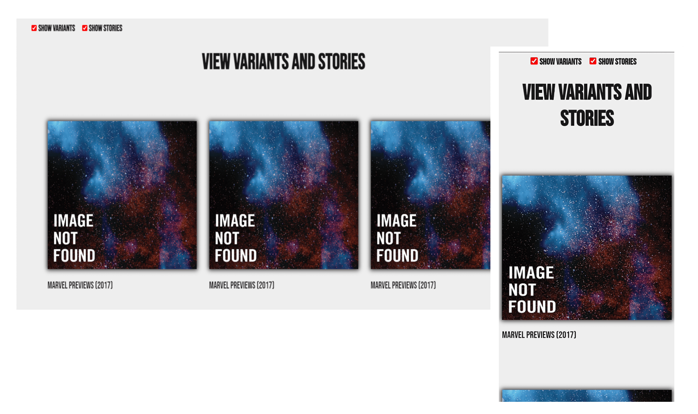
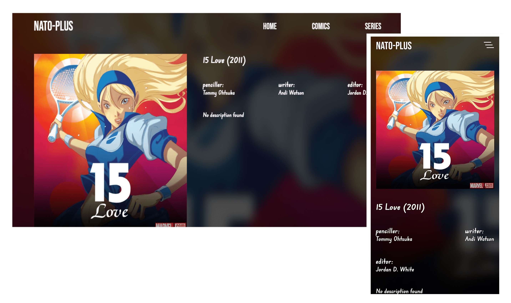
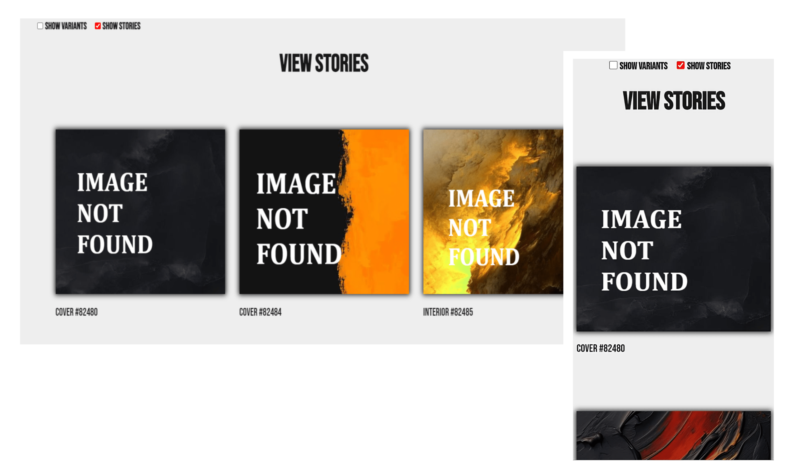
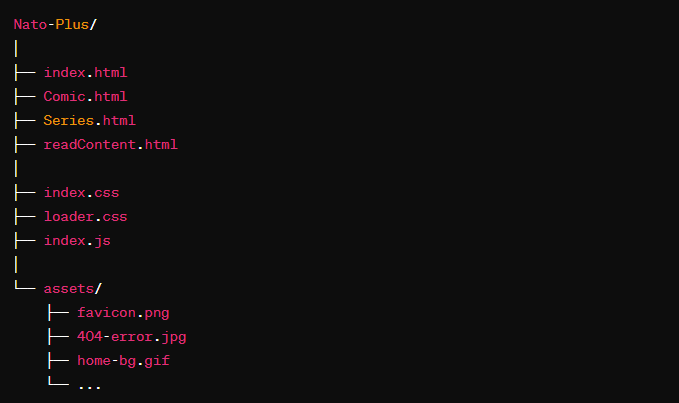

# Nato-Plus Web Application

This repository contains the codebase for the Nato-Plus web application, which allows users to explore and read comics and series online. The application is built using HTML, CSS, and JavaScript.

## Table of Contents

- OverView

- Screenshots

- Installation

- Features

- File Structure

- Technologies Used

- Contributors

- Contributing

## OverView

`In the dance of life, I'm the storm that refuses to be tamed.`

The Nato-Plus web application consists of multiple HTML pages, each catering to a specific functionality within the application. These functionalities include:

- Home Page
- Comic Page
- Series Page
- Read Content Page

Each HTML page is styled using CSS to ensure a visually appealing user interface, and JavaScript is used to provide interactivity and dynamic content loading.

## Screenshots










## Installation

To install this project you need to:

1. Install a code editor

   For Code Ediors:

   - Open your editor and navigate to the terminal.
   - Run this command:

   ```git
   git clone https://github.com/davidomotoso/Nato-plus.git
   ```

2. Navigate to your command prompt (cmd)

   - Open your command prompt.
   - Run this command:

   ```git
   git clone https://github.com/davidomotoso/Nato-plus.git
   ```

3. Navigate to the Nato-plus folder".

4. Open the HTML file (index.html) in a web browser.

## Features

### Home Page (index.html)

The home page serves as the landing page for the application. It includes:

- Navigation menu for easy access to different sections of the application
- Introductory content with an animated background
- Top trending comics section with dynamic loading of content
- Responsive design for optimal viewing experience across devices

### Comic Page (Comic.html)

The comic page allows users to browse and explore various comics available on the platform. It includes:

- Navigation menu for seamless navigation between different sections
- Loader animation while content is being fetched
- Display of comic thumbnails and titles
- Responsive design for mobile and tablet devices

### Series Page (Series.html)

The series page enables users to explore different series available on the platform. It offers:

- Navigation menu for easy access to various sections
- Loader animation indicating content loading
- Presentation of series content and images
- Responsive design ensuring compatibility with mobile and tablet devices

### Read Comic Page (readContent.html)

The read comic page enables users to read detailed information about a specific comic. It includes:

- Display of comic cover image and description
- Option to view variants and stories related to the comic
- Loader animation while content is being loaded
- Responsive layout for different screen sizes

## File Structure



## Technologies Used

[Marvel Api](https://developer.marvel.com/) for intergration of comics.

[Bootstrap Icons](https://icons.getbootstrap.com/) for navigation icon.

[Google Fonts](https://fonts.google.com/) for custom fonts.

## Contributors

[Omotoso David (Me)](https://github.com/davidomotoso)

[Ben Armstrong](https://github.com/Mortis-Coldsoul)

## Contributing

Pull requests are welcome. For major changes, please open an issue first to discuss what you would like to change.
